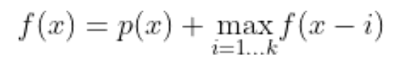
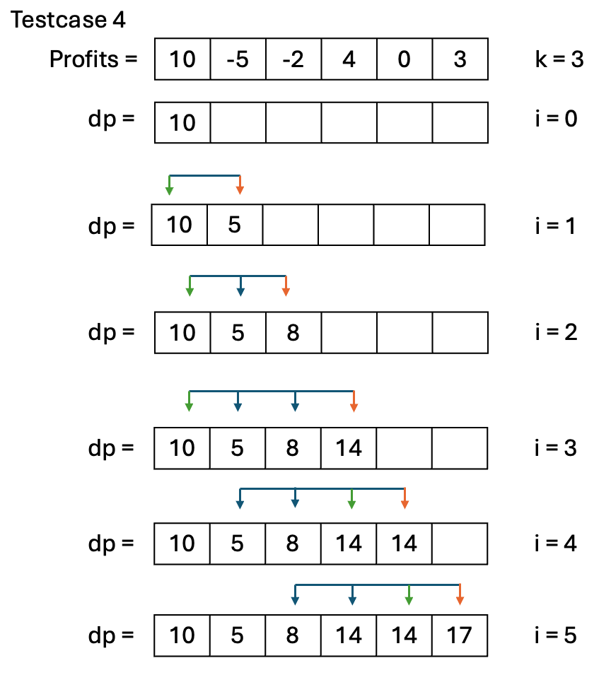

# Project 4: Circular Double-Ended Queues (Deque)
**Due: Thursday, March 14th at 9:00pm ET**

_This is not a team project, do not copy someone else’s work._

__

Assignment Overview
-------------------

In a typical FIFO (First in First out) queue, elements are added to one end of the underlying structure and removed from the opposite. These are natural for storing sequences of instructions: Imagine that instructions are added to the queue when first processed, and removed when completed. The first instruction processed will also be the first completed - we add it to the front, and remove it from the back.

A deque is a [double-ended queue](https://en.wikipedia.org/wiki/Double-ended_queue), meaning elements can be added or removed from either end of the queue. This generalizes the behavior described above to account for more complex usage scenarios. The ability to add or remove from both ends of the deque allows the structure to be used as both a **FIFO queue and a LIFO stack** simultaneously.

This structure is useful for storing undo operations, where more recent undoes are pushed and popped from the front of the deque and old/expired undoes are removed from the back of the deque. Trains, consisting of sequences of cars, can also be thought of as deques: cars can be added or removed from either end, but never the middle.

A circular queue is a queue of fixed size with end-to-end connections. This is a way to save memory as deleted elements in the queue can simply be overwritten. In the picture above, element 10 exists at index 0. Once it is removed (dequeued) from the queue, the index **front** will be offset but the value 10 remains. Once 4 more elements are enqueued, the 10 will have been overwritten, the circular queue will have reached its capacity (8), and needs to grow.

Circular queues are useful in situations with limited memory. Consider a router in an internet network. A package (a set of bits sent across the network) is sent to this router and it joins the router's processing queue. This router can only hold so many packets before it has to start dropping some. A circular queue would be useful here, as it optimizes memory usage.

A circular deque is a combination of a deque and a circular queue. It sets a max size and can grow and shrink like a circular queue, and it can enqueue/dequeue from both ends.


# Assignment Notes
1. **Manual grading is  30% of the points on this project. Submitted program is checked for its run time for all its functions and space complexity for its add, remove, and the application problem. Space complexity is only required for each project's add, remove and application problem. For these functions where the space complexity is checked, manual grade is split 50-50 for run time and space complexity. Be sure to review the rubric and adhere to complexity requirements!**
 Stacks and Queue ADTs  add, remove methods by design already allocate O(N) space. 
2. Docstrings (the multi-line comments beneath each function header) are NOT provided and will need to be completed for full credit.
3. Testcases are your friend: before asking about the form of input/output or what happens in a particular edge case, check to see if the testcases answer your question for you. By showing the expected output in response to each input, they supplement the specs provided here.
4. Don't be afraid to go to the D2L Course Tools page for tutorial videos on how to debug,  it will help you figure out where you're going wrong far more quickly than ad-hoc print statements!


# Tips

*   The use of [modulo (%)](https://docs.python.org/3/reference/expressions.html#binary-arithmetic-operations) is highly recommended
*   Understand what [amortized runtime](https://medium.com/@satorusasozaki/amortized-time-in-the-time-complexity-of-an-algorithm-6dd9a5d38045) is (also explained below)
*   Enqueue and Dequeue both have basic tests which test their functionality in conditions where shrink and grow will not be called. This allows you to test your enqueue and dequeue functions without having to implement grow/shrink.
*   Although the API lists enqueue/dequeue first, **it is common to implement grow/shrink and then enqueue/dequeue or grow->enqueue then shrink->dequeue**. The test cases are designed to allow you to implement these functions independently in the order which best suits you.

# Rules:

*   The use of Python's Queue and Deque library is **NOT ALLOWED** and any use of it will result in a 0 on this project
*   The use of .pop() is **PROHIBITED.**
    *   Any function using .pop() will be deducted all points for test cases and manual grading
    *   .pop(x) has a runtime of _O(n-x)_, where _n_ is the length of the python list .pop(x) is called on - in most situations, this will violate time complexity. 
*   Changing function signatures is not allowed and will result in all points lost for that particular function.
*   Docstrings (the multi-line comments beneath each function header) are NOT provided and will need to be completed for full credit..
*   Use of the **nonlocal** keyword will result in a 0 on the function is used on
    *   You should never need to use this keyword in this project. And if you are using it in a function in this class, you're doing something wrong.


# Assignment Specifications

-------------------------

"There's a term for people who don't read the project details : unemployed" - Dr. Owen.

#### class CircularDeque:

_DO NOT MODIFY the following attributes/functions_

*   **Attributes**
    *   **capacity: int:** the total amount of items that can be placed in your circular deque. Capacity grows and shrinks dynamically, but the capacity is never less than 4. It will always be greater than or equal to **size**
    *   **size: int:** the number of items currently in your circular deque
    *   **queue: list\[T\]:** The underlying structure holding the data of your circular deque. Many elements may be **None** if your current **size** is less than **capacity**. This grows and shrinks dynamically.
    *   **front: int:** an index indicating the location of the first element in the circular deque
    *   **back: int:** an index indicating the location of the last element in your circular deque
*   **\_\_init\_\_(self, data: list\[T\], front: int, capacity: int) -> None**
    *   Constructs a circular deque
    *   **data: list\[T\]:** a list containing all data to be inserted into the circular deque
    *   **front: int:** An index to offset the front pointer to test the circular behavior of the list without growing
    *   **capacity: int:** the capacity of the circular deque
    *   **Returns:** None
*   **\_\_str\_\_(self) -> str** and **\_\_repr\_\_(self) -> str**
    *   Represents the circular deque as a string
    *   **Returns:** str

_IMPLEMENT the following functions_

*   **\_\_len\_\_(self) -> int**
    *   Returns the length/size of the circular deque - this is the number of items currently in the circular deque, and will not necessarily be equal to the **capacity**
    *   This is a [magic method](https://www.tutorialsteacher.com/python/magic-methods-in-python) and can be called with **len(object\_to\_measure)**
    *   Time complexity: _O(1)_
    *   Space complexity: _O(1)_
    *   **Returns:** int representing length of the circular deque
*   **is\_empty(self) -> bool**  
    *   Returns a boolean indicating if the circular deque is empty
    *   Time complexity: _O(1)_
    *   Space complexity: _O(1)_
    *   **Returns:** True if empty, False otherwise
*   **front\_element(self) -> Optional[T]**  
    *   Returns the first element in the circular deque
    *   Time complexity: _O(1)_
    *   Space complexity: _O(1)_
    *   **Returns:** the first element if it exists, otherwise None
*   **back\_element(self) -> Optional[T]**  
    *   Returns the last element in the circular deque
    *   Time complexity: _O(1)_
    *   Space complexity: _O(1)_
    *   **Returns:** the last element if it exists, otherwise None
*   **grow(self) -> None**
    *   Doubles the capacity of deque by creating a new underlying python list with double the capacity of the old one and copies the values over from the current list.
    *   The new copied list will be 'unrolled' such that the front element will be at index `0` and the tail element will be at index `size - 1`. 
    *   Time complexity: _O(N)_
    *   Space complexity: _O(N)_
    *   **Returns:** None
*   **shrink(self) -> None**
    *   Halves the capacity of the deque (the reverse of grow). Copies over the contents of the old list to a new one with half the original capacity.
    *   The new copied list will be 'unrolled' s.t. the front element will be at index `0` and the tail element will be at index `size - 1`.
    *   **IMPORTANT**: the deque should *never* have a capacity lower than 4, **DO NOT** shrink when shrinking would result in a capacity less than 4
    *   Time complexity: _O(N)_
    *   Space complexity: _O(N)_
    *   **Returns:** None
*   **enqueue(self, value: T, front: bool = True) -> None:**  
    *   Add a value to either the front or back of the circular deque based off the parameter **front**
    *   If front is true, add the value to the front of the deque. Otherwise, add it to the back
    *   Call **grow()** if the size of the internal list has reached capacity
    *   **value: T:** value to add into the circular deque
    *   **front: bool:** which end of the deque to add the value
    *   Time complexity: _O(1)\*_
    *   Space complexity:  _O(1)\*_
    *   **Returns:** None
    *   (Shouldn't use more than constant time/auxiliary space when **grow() is not called**)
*   **dequeue(self, front: bool = True) -> Optional[T]:**  
    *   Remove an item from the queue
    *   Removes the front item by default, remove the back item if False is passed in
    *   Calls **shrink()** If the current size is less than or equal to 1/4 the current capacity, and 1/2 the current capacity is greater than or equal to 4, halves the capacity.
    *   Hint: You shouldn't delete the value from the dequeue (by setting it to None) as that spot will merely be overwritten when you enqueue on that spot so it's more efficient to only adjust the back/front pointer instead.
    *   **front: bool:** Whether to remove the front or back item from the dequeue
    *   Time complexity: _O(1)\*_
    *   Space complexity:  _O(1)\*_
    *   **Returns:** removed item, None if empty
    *   (Shouldn't use more than constant time/auxiliary space when **shrink() is not called**)

***[Amortized](https://medium.com/@satorusasozaki/amortized-time-in-the-time-complexity-of-an-algorithm-6dd9a5d38045)**. _Amortized Time Complexity_ means 'the time complexity a majority of the time'. Suppose a function has amortized time complexity _O(f(n))_ - this implies that the majority of the time the function falls into the complexity class _O(f(n)),_ however, there may exist situations where the complexity exceeds _O(f(n))._ The same logic applies to memory and defines the concept of _Amortized Space Complexity_.

Example:  **enqueue(self, value: T, front: bool)** has an amortized time complexity of _O(1)_. In the majority of situations, enqueueing an element takes a constant number of operations. However, when the Circular Deque is at capacity, grow(self) is called - this is an _O(n)_ operation, therefore in this particular scenario, enqueue exceeds its amortized bound.

## Application: Dystopian Starbucks 
<br>
The year is 2060: technology has automated so much of the workforce that the only jobs still available are in the service industry.
As a Starbucks employee, you are now paid based on a day's revenue, as opposed to an hourly wage. Hence, you fill out your timesheet only according to which days you were present in the shop.
However, your building's location struggles and often loses profits. Luckily, your job's one saving grace is that it's very generous with its (unpaid) vacation days, and within a given time period you only have to work once every `k` days in the period.
The only days in the time period when you **must** work are on the first and last days of a pay period.
You recognize that to survive within this business model, you must come into the shop on days when profit is maximized. Thus, you devise an algorithm to take a pay period and work interval `k` to maximize the profits you can make.

- **maximize_profits(profits: list[int], k: int) -> int:**.
  -  Takes in a pay period (as a list of profits), a work interval `k`, and returns the maximum profit that can be made within the pay period
  - **profits: list[int]:** A list of profits representing the amount of money made (or lost) for a given day
  - **k: int:** A _work interval_. You must work at least once every `k` days.
  - **Returns:** The maximum possible profit obtainable within the pay period
  - **Notes**: You are _guaranteed_ to work on the first and last days of the pay period
  - **Work pattern example**: If the length of a pay period is 5 days and your work interval is 3, then one pattern of working is to work day 1 (as required), skip days 2 and 3, work on day 4 (since you must work at least once every 3 days), and then work day 5 (as required).
  - `len(profits), k >= 1`. However, `k` may be larger than `len(profits)`.
  - You _are allowed_ to use a `list` in this problem
  - Time Complexity: _O(N)_ where N is the total number of numbers in the input list
  - Space Complexity: _O(N)_
  - **Important**: your solution must stricly be _O(N)_ time, not _O(N*k)_ to receive full credit. This means it must run irrespective of the value of the work interval `k`.

**An optimal solution should contain usage of the Circular Deque that you implemented**

### Examples

Ex. 1
```
Input: profits = [3, -8, 2], k = 2
Output: 5
```
The following profits were chosen: `[3, _, 2]`. The 2nd day was skipped.

Ex. 2
```
Input: profits = [-3, 4], k = 2
Output: 1
```
Every profit was included because the only days are the first and last day, which we must work on.

Ex. 3
```
Input: profits = [1, -3, -2, 4, 0], k = 3
Output: 5
```
The following numbers were chosen `[1, _, _, 4, 0]`. Days 2 and 3 were skipped.

Ex. 4
```
Input: profits = [100, -100, -300, -300, -300, -100, 100], k = 4
Output: 0
```
The following numbers were chosen `[100, -100, _, _, _, -100, 100]`.
Since `k` was 4, the optimal choice was to work days `1-2`, skip days `3-5`, and work on day `6`. Observe that we couldn't go from day `2` to day `7` since we must work at least once every `4` days

### Hints and suggestions 
This problem has many **overlapping sub-problems** and serves as an introduction to a technique called *dynamic programming*.
In situations where the answer to one problem helps you solve a subsequent, larger problem, we consider them as overlapping sub-problems. The application lends itself to this category due to its recursive structure. Consider the example `profits = [1, -2, -4, 1], k = 3, answer = 2`. Observe that we can solve this problem by considering elements prior to the end of the list. We got to an answer of `2` by looking at the past `k` elements before the last one and taking the maximum; `2 = max(1 + 1, -2 + 1, -4 + 1)`.
Notice that this logic applies to any goal position, not just the end. We can define this relationship with the recurrence relation below:  
    
where `x` is a valid index into `profits` and `p(x) = profits[x]`. Here, `f(x)` is the highest profit attainable when the goal position is index `x`.

We can transform this recurrence into a practical solution by using a table `dp` such that `dp[x] = f(x)`. Here's an example of how this solution works on testcase 4:  
  
At the `ith` iteration, we calculate the value of `dp[i]` by taking the maximum of the past `k` elements. The green arrow represents the largest element found, which is chosen to be summed with `profits[i]` to get `dp[i]`. This solution has an acceptable space complexity of *O(N)*, but the time complexity is not met. We always look to the past `k` elements, leading to an *O(N\*k)* time solution.
Your job is to solve this problem without making the runtime scale with the value of `k`.


## **Submission**
# **Submission Guidelines**

### **Deliverables:**

For each project, a `solution.py` file will be provided. Ensure to write your Python code within this file. For best
results:

- 📥 **Download** both `solution.py` and `tests.py` to your local machine.
- 🛠️ Use **PyCharm** for a smoother coding and debugging experience.

### **How to Work on a Project Locally:**

Choose one of the two methods below:

---

#### **APPROACH 1: Using D2L for Starter Package**

1. 🖥️ Ensure PyCharm is installed.
2. 📦 **Download** the starter package from the _Projects_ tab on D2L. _(See the tutorial video on D2L if needed)_.
3. 📝 Write your code and, once ready, 📤 **upload** your `solution.py` to Codio. _(Refer to the D2L tutorial video for
   help)_.

---

#### **APPROACH 2: Directly from Codio**

1. 📁 On your PC, create a local folder like `Project01`.
2. 📥 **Download** `solution.py` from Codio.
3. 📥 **Download** `tests.py` from Codio for testing purposes.
4. 🛠️ Use PyCharm for coding.
5. 📤 **Upload** the `solution.py` back to Codio after ensuring the existing file is renamed or deleted.
6. 🔚 Scroll to the end in Codio's Guide editor and click the **Submit** button.

---

### **Important:**

- Always **upload** your solution and **click** the 'Submit' button as directed.
- All project submissions are due on Codio. **Any submission after its deadline is subject to late penalties** .

**Tip:** While Codio can be used, we recommend working locally for a superior debugging experience in PyCharm. Aim to
finalize your project locally before submitting on Codio.


**Grading**
The following 100-point rubric will be used to determine your grade on Project4:

*   Tests (70)  
    *   00 - test\_len: \_\_/1
    *   01 - test\_is\_empty: \_\_/1
    *   02 - test\_front\_element: \_\_/2
    *   03 - test\_back\_element: \_\_/2
    *   04 - test\_front\_enqueue\_basic: \_\_/2
    *   05 - test\_back\_enqueue\_basic: \_\_/2
    *   06 - test\_front\_enqueue: \_\_/6
    *   07 - test\_back\_enqueue: \_\_/6
    *   08 - test\_front\_dequeue\_basic: \_\_/2
    *   09 - test\_back\_dequeue\_basic: \_\_/2
    *   10 - test\_front\_dequeue: \_\_/6
    *   11 - test\_back\_dequeue: \_\_/6
    *   12 - test\_grow: \_\_/4
    *   13 - test\_shrink: \_\_/4
    *   14 - test\_application: \_\_/17
    *   15 - test\_grow\_additional: \_\_/0
    *   16 - test\_shrink\_additional: \_\_/0
    *   17 - test\_comprehensive: \_\_/7
*   Manual (30)
    *   M0 - len(): \_\_/1           
    *   M1 - is\_empty: \_\_/1
    *   M2 - front\_element: \_\_/1
    *   M3 - back\_element: \_\_/1
    *   M4 - front\_enqueue: \_\_/2
    *   M5 - back\_enqueue: \_\_/2
    *   M6 - front\_dequeue: \_\_/2
    *   M7 - back\_dequeue: \_\_/2
    *   M8 - grow: \_\_/3
    *   M9 - shrink: \_\_/3
    *   M10 - application: \_\_/12
    *   M11 - feedback & citation: \_\_/0


* **Manual (30 points)**
  * Time complexity must be met for each function. 
  *Time and Space complexity of on add, remove and application problem and points are **divided equally** for each function. If you fail to meet time **or** space complexity in a given function, you receive half of the manual points for that function.
  * Loss of 1 point per missing docstring (max 5 point loss)
  * Loss of 2 points per changed function signature (max 20 point loss)
  * Loss of complexity and loss of testcase points for the required functions in this project. You may not use any additional data structures such as dictionaries, and sets!
  * You are required to utilize the `solution.py` module in the given framework for solving the application problem. The test cases are designed to verify its use; any attempts to circumvent these checks will lead to a score of zero.

  
  
* **Important reminder**
  Note students can not use Chegg or similar sites, see syllabus for details, use of outside resources for the application problem is strictly forbidden, use of outside resources is limited to max of 2 functions in a project.


    * **DOCSTRING** is not provided for this project. Please use Project 1 as a template for your DOCSTRING . 
    To learn more on what is a DOCSTRING visit the following website: [What is Docstring?](https://peps.python.org/pep-0257/)
      * One point per function that misses DOCSTRING.
      * Up to 5 points of deductions

This project was created by David Rackerby, along with contributions from Jacob Caurdy, Andrew Haas, Khushi Vora, Matt Kight, and Nate Gu.


