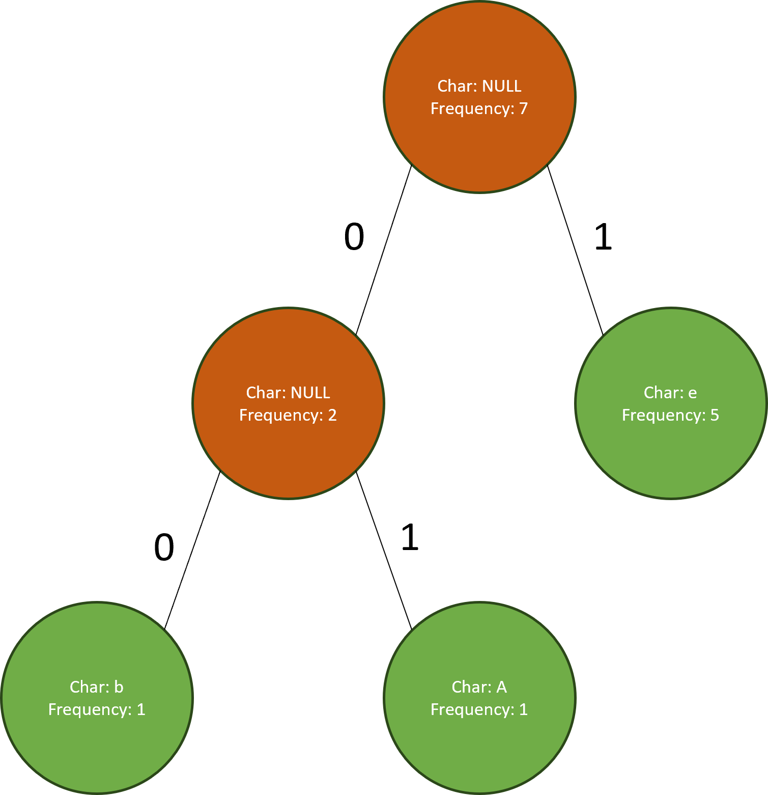

# Project 5: AVL Trees

**Due: March 28, 2024 @ 9:00pm EST**

_This is not a team project. Do not copy someone else’s work._

## Assignment Overview

[AVL trees](https://en.wikipedia.org/wiki/AVL_tree), named after computer scientists Georgy Adelson-Velsky and Evgenii Landis who introduced them in 1962, are a type of self-balancing [binary search tree (BST)](https://en.wikipedia.org/wiki/Binary_search_tree) designed to maintain operations in logarithmic time irrespective of data insertion and deletion patterns. Their introductory paper, "[An algorithm for the organization of information](https://zhjwpku.com/assets/pdf/AED2-10-avl-paper.pdf)," stands as a testament to their enduring relevance, especially in applications requiring a space-efficient data structure with quick insertion, search, and deletion capabilities.


A critical issue often encountered with traditional BSTs is their tendency to become _unbalanced_ depending on the order of data insertion and deletion, leading to operations taking linear time instead of logarithmic. For instance, inserting data in a sorted (or reverse-sorted) sequence results in a BST that resembles a linked list, with leaves growing predominantly in one direction.


While this may not pose significant challenges with small datasets, the performance gap between logarithmic and linear time becomes staggeringly evident when dealing with large databases comprising thousands or millions of records.


By self-balancing, AVL trees ensure that operations consistently take logarithmic time, providing a robust solution to the issues faced by traditional BSTs. In this project, you are tasked with implementing both a traditional BST and an AVL tree from the ground up in Python. Utilizing the AVL tree, you will address a machine learning-inspired application problem.

## Assignment Notes

1. **Generators for Space-Efficient Traversal**: In this project, you will employ Python `Generator` objects for tree traversal. This approach is notably space-efficient compared to returning a list of nodes (`List[Node]`), as it consumes _O(1)_ space instead of _O(n)_. Generators yield nodes sequentially and on-demand, providing a streamlined and memory-efficient solution. For a comprehensive introduction to Python generators, you can refer to [this article](https://realpython.com/introduction-to-python-generators/).

2. **Updating Heights and Balancing**: A prevalent mistake in this project is the omission or incorrect update of node heights, as well as improper tree rebalancing within insert and remove functions. Ensure to meticulously read the notes we've provided under each function's description in the specifications. Reflect on how recursion and the call stack can be leveraged to rebalance the tree, especially in relation to the node you've just inserted or removed.

3. **Simplifying AVL Trees**: While AVL Trees are inherently complex, breaking down each function into specific cases or checks can significantly simplify the implementation. Consider all possible scenarios for each operation, such as checking if the node you're working on is the root, or verifying the presence of a right node before proceeding with `node.right`. Ensure that you're updating the correct pointers throughout the process.

4. **Leveraging the Debugger**: Don’t hesitate to use the debugger; it is an invaluable tool, especially for deciphering the behavior of complex functions. Taking the time to familiarize yourself with its features will pay off, helping you verify whether your code is executing as expected and identifying any discrepancies in your logic.

5. **Utilizing Visualization Functions**: To aid in understanding your tree's structure, we have provided visualization and printing functions. You can easily visualize your tree by calling `tree.visualize()` on an instance of BinarySearch, AVLTree, or NearestNeighborClassifier. While we've done our best to ensure the accuracy of these visualizations, we acknowledge that they may not be flawless. If you encounter any issues, please let us know.

6. **Avoiding Global Variables**: Utilizing global variables (with the `nonlocal` keyword) in your implementation will result in a deduction of 20 points.

7. **Maintaining Function Signatures**: Altering the signatures of provided functions will lead to a deduction of 2 points per instance, accumulating up to a maximum of 20 points.

8. **Considering Inheritance**: Although this project could benefit from a reduction in duplicate code through the use of inheritance, we opted to keep the syntax straightforward and avoid additional object-oriented complexity. Nonetheless, it's a valuable exercise to ponder how the AVLTree class might be implemented as a subclass of the BinarySearchTree class, promoting code reuse between the two.

9. **Performance Comparison**: After completing the implementation of all BinarySearchTree and AVLTree functions, running the `solution.py` file will present a performance comparison between the two types of trees, showcasing the efficiency gains achieved with AVL Trees.

## Assignment Specifications

#### class Node:

This class implements a tree node, utilized by the `BinarySearchTree` and `AVLTree` classes.

_DO NOT MODIFY the following attributes/functions_

- **Attributes**:
  - **`value: T`**: The value held by the `Node`. It can be of any type, such as `str`, `int`, `float`, `dict`, or even a more complex object.
  - **`parent: Node`**: A reference to this `Node`'s parent `Node`. It may be `None` if the node has no parent.
  - **`left: Node`**: A reference to this `Node`'s left child `Node`. It may be `None` if the node has no left child.
  - **`right: Node`**: A reference to this `Node`'s right child `Node`. It may be `None` if the node has no right child.
  - **`height: int`**: The number of levels of `Node`s below this one. The height of a leaf `Node` is considered to be 0.

- **Methods**:
  - **`__init__(self, value: T, parent: Node = None, left: Node = None, right: Node = None) -> None`**:
    - This constructor initializes an AVL Tree node with the provided values.
    - Parameters:
      - **`value: T`**: The value to be held by the `Node`.
      - **`parent: Node`**: A reference to this `Node`'s parent `Node`. Defaults to `None`.
      - **`left: Node`**: A reference to this `Node`'s left child `Node`. Defaults to `None`.
      - **`right: Node`**: A reference to this `Node`'s right child `Node`. Defaults to `None`.
    - Returns: `None`.

  - **`__str__(self) -> str`** and **`__repr__(self) -> str`**:
    - These methods represent the `Node` as a string in the format `<value_held_by_node>`. For example, `<7>` would represent a `Node` object holding an integer value of 7, while `<None>` would represent a `Node` object holding a value of `None`.
    - These methods are automatically called when printing a `Node` to the console, and also when a `Node` is displayed in a debugger.
    - To invoke these methods, use `str(node)` instead of calling `node.__str__()` directly.
    - Returns: `str`.

#### class BinarySearchTree:

This class implements a traditional Binary Search Tree (BST).

_DO NOT MODIFY the following attributes/functions_

- **Attributes**:
  - **`origin: Node`**: The root node of the entire `BSTree`. It might be `None` if the tree is empty. The term `origin` helps distinguish between the root of the entire tree and the root of a subtree within the tree. Essentially, any `Node` in a `BSTree` can be considered as the root of a subtree comprising all the nodes below it, and `origin` refers to the highest root in the tree.
  - **`size: int`**: The total number of nodes present in the `BSTree`.

- **Methods**:
  - **`__init__(self) -> None`**:
    - Constructs an empty `BSTree`, initializing `origin` to `None` and `size` to 0.
    - Returns: `None`.
    
  - **`__str__(self) -> str`** and **`__repr__(self) -> str`**:
    - Returns a neatly formatted string representation of the binary search tree. Each node in this representation follows the format `{value},h={height},⬆{parent.value}`.
    - These methods are automatically called when the tree is printed to the console or when a node is displayed in a debugger.
    - Use `str(tree)` instead of `tree.__str__()` to invoke these methods.
    - Returns: `str`.

  - **`visualize(self, filename="bst_visualization.svg") -> str`**:
    - Generates an SVG image file representing the binary search tree.
    - `filename: str`: The name of the file to save the SVG image as. It should have a `.svg` extension. Defaults to "bst_visualization.svg".
    - Returns: The SVG string as `str`.

_IMPLEMENT the following functions_

- **`height(self, root: Node) -> int`**:
  - Calculates and returns the height of a subtree in the `BSTree`, handling the case where `root` is `None`. Note that an empty subtree has a height of -1.
  - This method is simple to implement, particularly if you recall that a `Node`'s height (if it exists) is stored in its `height` attribute.
  - This function is not directly tested as it is very straightforward, but it will be utilized by other functions.
  - Time / Space Complexity: O(1) / O(1).
  - `root: Node`: The root of the subtree whose height is to be calculated.
  - Returns: The height of the subtree at `root`, or -1 if `root` is `None`.

- **`insert(self, root: Node, val: T) -> None`**:
  - Inserts a node with the value `val` into the subtree rooted at `root`, returning the root of the balanced subtree after the insertion.
  - If `val` already exists in the tree, the function does nothing.
  - Make sure to update the `size` and `origin` attributes of the `BSTree` object, and properly set the parent/child pointers when inserting a new `Node`.
  - This method is simpler to implement when done recursively.
  - Time / Space Complexity: O(h) / O(1), where *h* is the height of the tree.
  - `root: Node`: The root of the subtree where `val` is to be inserted.
  - `val: T`: The value to insert.
  - Returns: None.

- **`remove(self, root: Node, val: T) -> Node`**:
  - Removes the node with the value `val` from the subtree rooted at `root`, and returns the root of the subtree after the removal.
  - If `val` does not exist in the `BSTree`, the function does nothing.
  - Update `size` and `origin` attributes of the `BSTree` object, and correctly update the parent/child pointers and `height` attributes of affected `Node` objects.
  - Take into account the [three distinct cases of BST removal](https://en.wikipedia.org/wiki/Binary_search_tree#Deletion) when implementing this method.
  - If you are removing a node with two children, swap the value of this node with its predecessor, and then recursively remove the predecessor node (which will have the value to be removed after the swap and is guaranteed to be a leaf).
    - While it is technically possible to swap with the successor node in cases of two-child removal, our tests will assume you will swap with the predecessor.
  - Time / Space Complexity: O(h) / O(1), where *h* is the height of the tree.
  - `root: Node`: The root of the subtree from which to delete `val`.
  - `val: T`: The value to be deleted.
  - Returns: The root of the new subtree after the removal (could be the original root).

- **`search(self, root: Node, val: T) -> Node`**:
  - Searches for and returns the `Node` containing the value `val` in the subtree rooted at `root`.
  - If `val` is not present in the subtree, the function returns the `Node` below which `val` would be inserted as a child. For example, in a BST 1-2-3 tree (with 2 as the root and 1, 3 as children), `search(node_2, 0)` would return `node_1` because the value 0 would be inserted as a left child of `node_1`.
  - This method is simplest to implement recursively.
  - Time / Space Complexity: O(h) / O(1), where *h* is the height of the tree.
  - `root: Node`: The root of the subtree in which to search for `val`.
  - `val: T`: The value to search for.
  - Returns: The `Node` containing `val`, or the `Node` below which `val` would be inserted as a child if it does not exist.

#### class AVLTree

This class implements a self-balancing Binary Search Tree (BST) to ensure faster operation times.

##### Attributes (Do not modify)
- **origin (Node):** The root node of the AVLTree, which could potentially be `None`. This helps distinguish between the root of the entire AVLTree and the root of any subtree within it. Essentially, any Node within the AVLTree can be seen as the root of its own subtree, with `origin` being the root of them all.
- **size (int):** The total number of nodes present in the AVLTree.

##### Methods (Do not modify)
- **\_\_init\_\_(self) -> None:**
  - Creates an empty AVLTree, setting `origin` to `None` and `size` to zero.
  - **Returns:** None

- **\_\_str\_\_(self) -> str** and **\_\_repr\_\_(self) -> str:**
  - Provides a visually pleasing string representation of the binary tree, formatting each node as `{value},h={height},⬆{parent.value}`.
  - Python will automatically use this method when a Node is printed to the console, and PyCharm will use it when displaying a Node in the debugger.
  - To invoke this method, use `str(node)` instead of `node.__str__()`.
  - **Returns:** A string representation of the AVLTree.

- **visualize(self, filename="avl_tree_visualization.svg") -> str:**
  - Generates an SVG image file representing the binary tree.
  - **Parameters:** 
    - **filename (str):** The name for the output SVG file. Defaults to "avl_tree_visualization.svg".
  - **Returns:** The SVG string.

##### Methods to Implement
- **height(self, root: Node) -> int:**
  - Calculates the height of a subtree in the AVL tree, handling cases where `root` might be `None`. Remember, the height of an empty subtree is defined as -1.
  - **Parameters:** 
    - **root (Node):** The root node of the subtree whose height you wish to determine.
  - **Returns:** The height of the subtree rooted at `root`.
  - **Time / Space Complexity:** O(1) / O(1)

- **left_rotate(self, root: Node) -> Node**
  - This method performs a left rotation on the subtree rooted at `root`, returning the new root of the subtree after the rotation.
  - **Parameters:**
    - **root (Node):** The root node of the subtree that is to be rotated.
  - **Returns:** The root of the new subtree post-rotation.
  - **Time / Space Complexity:** O(1) / O(1)

- **right_rotate(self, root: Node) -> Node**
  - This method performs a right rotation on the subtree rooted at `root`, returning the new root of the subtree after the rotation.
  - It should be almost identical in implementation to `left_rotate`, differing only in a few lines of code.
  - **Parameters:**
    - **root (Node):** The root node of the subtree that is to be rotated.
  - **Returns:** The root of the new subtree post-rotation.
  - **Time / Space Complexity:** O(1) / O(1)

- **balance_factor(self, root: Node) -> int**
  - This method computes the balance factor of the subtree rooted at `root`.
  - The balance factor is calculated as `h_L - h_R`, where `h_L` is the height of the left subtree, and `h_R` is the height of the right subtree.
  - In a properly balanced AVL tree, all nodes should have a balance factor in the set {-1, 0, +1}. A balance factor of -2 or +2 triggers a rebalance.
  - For an empty subtree (where `root` is `None`), the balance factor is 0.
  - To maintain time complexity, update the `height` attribute of each node during insertions/deletions/rebalances, allowing you to use `h_L = left.height` and `h_R = right.height` directly.
  - **Parameters:**
    - **root (Node):** The root node of the subtree on which to compute the balance factor.
  - **Returns:** An integer representing the balance factor of `root`.
  - **Time / Space Complexity:** O(1) / O(1)

- **rebalance(self, root: Node) -> Node**
  - This function rebalances the subtree rooted at `root` if it is unbalanced, and returns the root of the resulting subtree post-rebalancing.
  - A subtree is considered unbalanced if the balance factor `b` of the `root` satisfies `b >= 2 or b <= -2`.
  - There are four types of imbalances possible in an AVL tree, each requiring a specific sequence of rotations to restore balance. You can find more details on these [here](https://en.wikipedia.org/wiki/AVL_tree#Rebalancing).
  - **Parameters:**
    - **root (Node):** The root of the subtree that potentially needs rebalancing.
  - **Returns:** The root of the new, potentially rebalanced subtree.
  - **Time / Space Complexity:** O(1) / O(1)

- **insert(self, root: Node, val: T) -> Node**
  - This function inserts a new node with value `val` into the subtree rooted at `root`, balancing the subtree as necessary, and returns the root of the resulting subtree.
  - If a node with value `val` already exists in the tree, the function does nothing.
  - This function updates the `size` and `origin` attributes of the `AVLTree`, sets the parent/child pointers correctly when inserting the new `Node`, updates the `height` attribute of affected nodes, and calls `rebalance` on all affected ancestor nodes.
  - The function is most easily implemented recursively.
  - **Parameters:**
    - **root (Node):** The root of the subtree where `val` is to be inserted.
    - **val (T):** The value to be inserted.
  - **Returns:** The root of the new, balanced subtree.
  - **Time / Space Complexity:** O(log n) / O(1)

- **remove(self, root: Node, val: T) -> Node**
  - This function removes the node with value `val` from the subtree rooted at `root`, balances the subtree as necessary, and returns the root of the resulting subtree.
  - If a node with value `val` does not exist in the tree, the function does nothing.
  - The function updates the `size` and `origin` attributes of the `AVLTree`, sets the parent/child pointers correctly, updates the `height` attribute of affected nodes, and calls `rebalance` on all affected ancestor nodes.
  - The removal process depends on whether the node to be removed has zero, one, or two children, with different strategies for each case. In the case of a node with two children, the function swaps its value with that of its predecessor (the maximum value node of its left subtree), and then recursively removes the predecessor node.
  - The function is implemented recursively.
  - **Parameters:**
    - **root (Node):** The root of the subtree from which `val` is to be removed.
    - **val (T):** The value to be removed.
  - **Returns:** The root of the new, balanced subtree.
  - **Time / Space Complexity:** O(log n) / O(1)

- **min(self, root: Node) -> Node**
  - This function searches for and returns the `Node` containing the smallest value within the subtree rooted at `root`.
  - The implementation of this function is most straightforward when done recursively.
  - **Parameters:**
    - **root (Node):** The root of the subtree within which to search for the minimum value.
  - **Returns:** A `Node` object that holds the smallest value in the subtree rooted at `root`.
  - **Time / Space Complexity:** O(log n) / O(1)

- **max(self, root: Node) -> Node**
  - This function searches for and returns the `Node` containing the largest value within the subtree rooted at `root`.
  - Like the min function, the implementation of this function is most straightforward when done recursively.
  - **Parameters:**
    - **root (Node):** The root of the subtree within which to search for the maximum value.
  - **Returns:** A `Node` object that holds the largest value in the subtree rooted at `root`.
  - **Time / Space Complexity:** O(log n) / O(1)

- **search(self, root: Node, val: T) -> Node**
  - This function searches for the `Node` with the value `val` within the subtree rooted at `root`.
  - If the value `val` does not exist within this subtree, the function will return the `Node` under which `val` would be inserted if it were added to the tree. For instance, in a balanced binary search tree of 1-2-3 (where 2 is the root, and 1 and 3 are left and right children respectively), calling `search(node_2, 0)` would return `node_1`, because if we were to insert 0 into this tree, it would be added as the left child of 1.
  - The implementation of this function is most straightforward when done recursively.
  - **Parameters:**
    - **root (Node):** The root of the subtree within which to search for `val`.
    - **val (T):** The value to be searched for within the subtree rooted at `root`.
  - **Returns:** A `Node` object containing `val` if it exists within the subtree, and if not, the `Node` under which `val` would be inserted as a child.
  - **Time / Space Complexity:** O(log n) / O(1)

- **inorder(self, root: Node) -> Generator[Node, None, None]**
  - This function performs an inorder traversal (left, current, right) of the subtree rooted at `root`, generating the nodes one at a time using a [Python generator](https://realpython.com/introduction-to-python-generators/).
  - Use `yield` to produce individual nodes as they are encountered, and `yield from` for recursive calls to `inorder`.
  - Ensure that `None`-type nodes are not yielded.
  - **Important**: To pass the test case for this function, you must also make the AVLTree class iterable, enabling the usage of `for node in avltree` to iterate over the tree in an inorder manner.
  - **Time / Space Complexity:** O(n) / O(1). Although the entire tree is traversed, the generator yields nodes one at a time, resulting in constant space complexity.
  - **Parameters:**
    - **root (Node):** The root node of the current subtree being traversed.
  - **Returns:** A generator yielding the nodes of the subtree in inorder.

- **\_\_iter\_\_(self) -> Generator[Node, None, None]**
  - This method makes the AVL tree class iterable, allowing you to use it in loops like `for node in tree`.
  - For the iteration to work, this function should be implemented such that it returns the generator from the inorder traversal of the tree.
  - **Returns:** A generator yielding the nodes of the tree in inorder.
  - **Implementation Note:** This function should be one line, calling the `inorder` function.

- **preorder(self, root: Node) -> Generator[Node, None, None]**
  - This function performs a preorder traversal (current, left, right) of the subtree rooted at `root`, generating the nodes one at a time using a [Python generator](https://realpython.com/introduction-to-python-generators/).
  - Use `yield` to produce individual nodes as they are encountered, and `yield from` for recursive calls to `preorder`.
  - Ensure that `None`-type nodes are not yielded.
  - **Time / Space Complexity:** O(n) / O(1). Although the entire tree is traversed, the generator yields nodes one at a time, resulting in constant space complexity.
  - **Parameters:**
    - **root (Node):** The root node of the current subtree being traversed.
  - **Returns:** A generator yielding the nodes of the subtree in preorder.

- **postorder(self, root: Node) -> Generator[Node, None, None]**
  - This function performs a postorder traversal (left, right, current) of the subtree rooted at `root`, generating the nodes one at a time using a [Python generator](https://realpython.com/introduction-to-python-generators/).
  - Utilize `yield` to produce individual nodes as they are encountered, and `yield from` for recursive calls to `postorder`.
  - Ensure that `None`-type nodes are not yielded.
  - **Time / Space Complexity:** O(n) / O(1). The entire tree is traversed, but the use of a generator yields nodes one at a time, maintaining constant space complexity.
  - **Parameters:**
    - **root (Node):** The root node of the current subtree being traversed.
  - **Returns:** A generator yielding the nodes of the subtree in postorder. A `StopIteration` exception is raised once all nodes have been yielded.

- **levelorder(self, root: Node) -> Generator[Node, None, None]**
  - This function performs a level-order (breadth-first) traversal of the subtree rooted at `root`, generating the nodes one at a time using a [Python generator](https://realpython.com/introduction-to-python-generators/).
  - Use the `queue.SimpleQueue` class for maintaining the queue of nodes during the traversal. [Refer to the official documentation for more information.](https://docs.python.org/3/library/queue.html#queue.SimpleQueue)
  - Utilize `yield` to produce individual nodes as they are encountered.
  - Ensure that `None`-type nodes are not yielded.
  - **Time / Space Complexity:** O(n) / O(n). The entire tree is traversed, and due to the nature of level-order traversal, the queue can grow to O(n), particularly in a [perfect binary tree](https://www.programiz.com/dsa/perfect-binary-tree) scenario.
  - **Parameters:**
    - **root (Node):** The root node of the current subtree being traversed.
  - **Returns:** A generator yielding the nodes of the subtree in level-order. A `StopIteration` exception is raised once all nodes have been yielded.

# Application: Stock Market

It's your first day as the manager of an index fund, which is a collection of stocks. Your job is to have the best return for your investors. You decide to do that by removing poorly performing penny stocks. However, why do this manually when you can automate it with code! You are given the index fund data as an AVL Tree. Your job is to remove all stocks with a price to earnings ration of less a given threshold. Below are the specs for this problem.


Image credit: Britannica

#### class Stock:

This class implements a Stock object. 

_DO NOT MODIFY the following attributes/functions_

**Attributes (Do not modify)**
  - **ticker: string**: The ticker symbol of the Stock.
  - **name: string**: The name of the Stock.
  - **price: float**: The price of the Stock.
  - **pe: float**: The price to earnings ratio of the Stock.
  - **mkt_cap: int**: The market cap of the Stock.
  - **div_yield: float**: The dividend yield of the Stock.

**Methods**:
  - **__init__(self, ticker: string, name: string, price: float, pe: float, mkt_cap: int, div_yield: float) -> None**:
    - This constructor initializes a stock node with the provided values.
    - Parameters:
      - **ticker: string**: The ticker symbol of the Stock.
      - **name: string**: The name of the Stock.
      - **price: float**: The price of the Stock.
      - **pe: float**: The price to earnings ratio of the Stock.
      - **mkt_cap: int**: The market cap of the Stock.
      - **div_yield: float**: The dividend yield of the Stock.
    - Returns: None.
  - **\_\_str__(self) -> str** and **\_\_repr__(self) -> str**:
    - These methods represent the `Stock` as a string in the format `{self.ticker}: PE: {self.pe}`.
    - These methods are automatically called when printing a `Stock` to the console, and also when a `Stock` is displayed in a debugger.
    - To invoke these methods, use `str(stock)` instead of calling `stock.__str__()` directly.
    - Returns: str.
  - **\_\_lt__(self, other) -> bool** and **\_\_eq__(self, other) -> bool**:
    - Parameters:
      - **other: Stock**: Stock to be compared with `this`.
    - These methods compare one Stock to another Stock. 
    - Call it like this: `stock == other_stock` or `stock < other_stock`.
    - Returns: bool.
- **make_stock_from_dictionary(stock_dictionary: dict[str: str]) -> Stock**
  - This function converts a given stock dictionary into a Stock.
  - **Parameters:**
    - **stock_dictionary (dict[str: str]):** The dictionary to be converted.
  - **Returns:** A Stock with the data from the given dict.

- **build_tree_with_stocks(stocks_list: List[dict[str: str]]) -> AVLTree**
  - This function converts a given dictionary list into an AVL Tree.
  - **It is highly recommended to use make_stock_from_dictionary() in this method**
  - **Time / Space Complexity:** O(nlog(n)) / O(n). 
  - **Parameters:**
    - **stocks_list (List[dict[str: str]]):** The list of dicts to be converted.
  - **Returns:** An AVL Tree with the given data from the list of dicts.

#### Methods to Implement

- **recommend_stock(stock_tree: AVLTree, user: User, action: str) -> Optional[Stock]:**
  - The recommend_stock function is designed to aid investors (users) in making informed decisions by recommending best 
  stock to buy or sell based on specified criteria. Utilizing the AVL Tree data structure, this function sifts through 
  stocks to find the one that best matches the investor's financial thresholds and goals.
  - This function analyzes stocks within an AVL Tree to identify the most suitable stock to buy or sell, 
  according to the user's predefined criteria such as the P/E ratio and dividend yield.
  - For buying actions, it prioritizes stocks that are undervalued but show promising dividend yields. Conversely, 
  for selling actions, it looks for stocks potentially overvalued or those that do not meet the desired income from 
  dividends.
  - **Parameters:**
    - **stock_tree (AVLTree):**  The AVL Tree containing stock nodes. 
    - **user (User):** A user object representing the investor's preferences. It includes attributes such as name, 
    pe_ratio_threshold, and div_yield_threshold to guide the stock recommendation process.
    - **action (str):** A string indicating the desired action, either 'buy' or 'sell'. This determines the criteria 
    used to filter and recommend stocks.
  - **Returns: Optional[Stock]** The function returns a Stock object representing the recommended stock that best fits 
  the user's criteria. If no stock meets the criteria, None is returned.
  - **Time Complexity:** O(log(n)) and **Space Complexity:** O(1)

- **prune(stock_tree: AVLTree, threshold: float = 0.05) -> None**
  - *This is the primary function for this application problem*
  - This function removes subtrees of the given Stock AVL Tree where all `pe` values are less than `threshold`.
  - It is recommended to be implemented recursively.
  - **Time / Space Complexity:** O(nlog(n)) / O(1). 
  - **Parameters:**
    - **stock_tree (AVL_Tree):** The AVL Tree to be pruned.
    - **threshold (float):** Any subtree with all `pe` values less than this gets removed.
  - **Returns:** None. It modifies the AVL Tree in place.
  - **TIP**: You may need to create helper functions for this problem.

#### Examples (for the `prune` function )

Ex. 1
```
Input: threshold=0.20, avlTree =>
                            ___________________<Stock: Ticker: AAPL, PE: 0.3>_____________________
                           /                                                     \                                                                        \
          ____<Stock: Ticker: MSFT, PE: 0.15>____________<Stock: Ticker: GOOGL, PE: 0.4>__________                                                                                                                                                                                                                
  
Output: None but AVL tree should look like ->

                          -------------------<Stock: Ticker: AAPL, PE: 0.3>-------------------
                                                                    \
                                                                <Stock: Ticker: GOOGL, PE: 0.4>

```
The stock with ticker MSFT has a PE of 0.15 which is less than the threshold of 0.20. Therefore, it is removed from the tree.

Ex. 2
```
Input: threshold=0.35, avlTree => 

                                                                                          _______________________________________________________CSCO: PE: 0.202________________________________________________
                                                                                         /                                                                                                \
                                                      _________________INTC: PE: 0.158_________________                                                                 __________________MSFT: PE: 0.285_________________
                                                     /                                          \                                                                            /                                     \
                    _________________IBM: PE: 0.146,h=1                               ORCL: PE: 0.183                                              _____________AAPL: PE: 0.253                         GOOGL: PE: 0.307____________
                 /                                                                                                                                             /                                                                \
          HPQ: PE: 0.127                                                                                                                                DELL: PE: 0.221                                                  AMD: PE: 0.356                                                                                                                

Output: None but AVL tree should look like ->

AMD: PE: 0.356
```

Ex. 3
```
Input: threshold=0.30, avlTree => 

                                                                                          _______________________________________________________CSCO: PE: 0.202________________________________________________
                                                                                         /                                                                                                \
                                                      _________________INTC: PE: 0.158_________________                                                                 __________________MSFT: PE: 0.285_________________
                                                     /                                          \                                                                            /                                     \
                    _________________IBM: PE: 0.146,h=1                               ORCL: PE: 0.183                                              _____________AAPL: PE: 0.253                         GOOGL: PE: 0.307____________
                 /                                                                                                                                             /                                                                \
          HPQ: PE: 0.127                                                                                                                                DELL: PE: 0.221                                                  AMD: PE: 0.356                                                                                                                

Output: None but AVL tree should look like ->

GOOGL: PE: 0.307_________________
                       \
             AMD: PE: 0.356,h=0
```

**Explanation:**
Since the threshold is 0.30, all tickers with PE less than 0.30 are removed from the AVL tree, leaving just GOOGL and AMD left.

# Extra Credit: Huffman Compression

There is a second application problem for this project that is for extra credit. See Zybooks 27.1 Huffman compression 
for assistance.

## Huffman Compression

Huffman compression is a method by which data is compressed to take up a smaller number of bits. In this problem 
we are going to be dealing with strings because each character is one byte. The Huffman compression method starts 
by finding a frequency table of characters for the string you are given. Then you have to create your Huffman Tree Nodes 
and put them into a minheap (the blackbox class). For this project the way a minheap works under the hood is out of 
scope. However, you will need to use it (see description below for more details). Finally, you need to create your 
Huffman tree. A Huffman tree is a binary tree where each character from our string is stored in the leaf nodes. 
Frequency data is also stored at all nodes in these trees. The tree obeys the law that the frequency data stored at the 
parent of any two nodes is the sum of frequencies stored at the two nodes.

For example:


You may notice that the tree has 0 labels for left branches and 1 labels for right branches. That is because ultimately 
the goal of this tree is to encode our data in the most efficient way possible. So the bits for the b character in the 
above example would be 00, for A it would be 01, and for e it would be 1. The great thing about a Huffman tree is that 
it prioritizes encoding the more frequent characters with fewer bits. This results in a shorter overall size.

Your goal is to implement the build function in the Huffman tree class.

### Some context for the Blackbox class:
We have provided you with a class called Blackbox. Under the hood this class is something called a minheap which is 
something you will learn soon. To emphasize that you don't need to understand how a minheap works, you just need to use 
it in the specified way, we have named it blackbox. For our purposes right now you can think of our blackbox/minheap 
class as an array that follows an important property. Blackbox has two important methods the first is store and the 
second is get_next. When you call store you give this blackbox some element to put into the array and this occurs in 
O(log n) time complexity. Then when get_next is called it will always retrieve the minimum element in O(1) time 
complexity.

### How To Build A Huffman Tree
1. Create a frequency table (that should be a familiar task).
2. Create the Huffman nodes you need with the appropriate frequency and character for the frequency table. Store these 
nodes in a Blackbox object by calling store and providing the node as an argument.
3. Call get_next twice to get two nodes with the smallest frequencies. Create a new node that is the parent of those 
nodes (**DO NOT PROVIDE A CHAR ARGUMENT**) setting freq to the sum of the two nodes we took from blackbox. Make the two 
nodes the children of our new node. Store the new parent node back in the Blackbox via the store method. Repeat until 
you don't have two nodes to work with (Blackbox has a len function).
4. Finally, you should have one node in your blackbox at which point you should pop that node and make it the root of 
your Huffman tree instance.

### Function Description:

**build(self, chars: string) -> None**
- Given some input construct a Huffman tree based off that input.
- Note the required time complexity is difficult to analyze since nodes are being replaced into the blackbox/minheap. 
The total number of nodes is a tree is equal to 2n - 1 where n = # of leaf nodes.
- *Required Time Complexity: O(n\*logn)*
- *Required Space Complexity: O(n)*
- input: string: A string to create a Huffman tree based off of. These are the characters to calculate your frequencies 
from.
 - Returns: None.

#### Example

```
Input: 'calculus'

Output:
                             ____________________________<Char: NULL, Freq: 8>___________________________
                            /                                                                         \
          _________<Char: NULL, Freq: 4>________                                         _________<Char: NULL, Freq: 4>___________________________
         /                                   \                                       /                                                      \
<Char: l, Freq: 2>                    <Char: c, Freq: 2>                    <Char: u, Freq: 2>                              _________<Char: NULL, Freq: 2>________
                                                                                                                           /                                   \
                                                                                                                  <Char: a, Freq: 1>                    <Char: s, Freq: 1>
```

**Explanation:**
The frequencies are calculated for each character from the input which gives us l = 2, c = 2, u = 2, a = 1, s = 1.
Then these are put into the Blackbox class. They are then drawn from (getting the min element) so we get nodes a and s
first. We create the parent of this node with frequency 2 which is then put back into the box. Then u and the parent 
of a and s are drawn and combined similarly. Then c and l are drawn and combined and finally, the parent of u, a, and 
s is combined with the parent of c and l.

# **Submission Guidelines**

### **Deliverables:**

For each project, a `solution.py` file will be provided. Ensure to write your Python code within this file. For best results:
- 📥 **Download** both `solution.py` and `tests.py` to your local machine.
- 🛠️ Use **PyCharm** for a smoother coding and debugging experience.

### **How to Work on a Project Locally:**

Choose one of the two methods below:

---

#### **APPROACH 1: Using D2L for Starter Package**
1. 🖥️ Ensure PyCharm is installed.
2. 📦 **Download** the starter package from the *Projects* tab on D2L. *(See the tutorial video on D2L if needed)*.
3. 📝 Write your code and, once ready, 📤 **upload** your `solution.py` to Codio. *(Refer to the D2L tutorial video for help)*.

---

#### **APPROACH 2: Directly from Codio**
1. 📁 On your PC, create a local folder like `Project01`.
2. 📥 **Download** `solution.py` from Codio.
3. 📥 **Download** `tests.py` from Codio for testing purposes.
4. 🛠️ Use PyCharm for coding.
5. 📤 **Upload** the `solution.py` back to Codio after ensuring the existing file is renamed or deleted.
6. 🔚 Scroll to the end in Codio's Guide editor and click the **Submit** button.

---

### **Important:**
- Always **upload** your solution and **click** the 'Submit' button as directed.
- All project submissions are due on Codio. **Any submission after its deadline is subject to late penalties** .
  
**Tip:** While Codio can be used, we recommend working locally for a superior debugging experience in PyCharm. Aim to finalize your project locally before submitting on Codio.

#### Grading

- Tests (70)
  - `BinarySearchTree`: \_\_/6
    - `insert`: \_\_/2
    - `remove`: \_\_/2
    - `search`: \_\_/2
  - `AVLTree`: \_\_/44
    - `rotate`: \_\_/5
    - `balance_factor`: \_\_/1
    - `rebalance`: \_\_/7
    - `insert`: \_\_/7
    - `remove`: \_\_/7
    - `min`: \_\_/1
    - `max`: \_\_/1
    - `search`: \_\_/5
    - `inorder`/`__iter__`: \_\_/1
    - `preorder`: \_\_/1
    - `postorder`: \_\_/1
    - `levelorder`: \_\_/1
    - `avl_comprehensive`: \_\_/6
  - `StockImplementations`: \_\_/20
    - `simple_pruning`: \_\_/1
    - `advanced_pruning`: \_\_/9
    - `recommend_stock`: \_\_/10
- Extra Credit (20)
  - `build`: \_\_/10
  - `compression_decompression`: \_\_/10

**Note on Comprehensive Testing:**

If your solution fails to pass a comprehensive test for a specific function during our assessment, **half of the manual
points allocated for that function will be deducted**. This is to emphasize the importance of not only meeting basic
requirements but also ensuring robustness and correctness in your code. Consider these comprehensive tests as tools for
ensuring quality and resilience in your solutions.

**Additional Note on Scenario Generation:**

While we make every effort to generate test cases that encompass every possible scenario, there might be times when some edge cases are inadvertently overlooked. Nevertheless, should we identify any scenario where your submitted logic doesn't hold, even if it's not part of our provided test cases, we reserve the right to deduct from the manual points. This highlights the significance of crafting logic that doesn't merely pass the given tests, but is genuinely resilient and correctly addresses the problem's entirety. Always strive to think beyond the provided cases, ensuring that your solutions are comprehensive and robust.

- Manual (30)
  - Time and space complexity points are **all-or-nothing** for each function. If you fail to meet time **or** space complexity in a given function, you do not receive manual points for that function.
  - Loss of 1 point per missing docstring (max 3 point loss)
  - Loss of 2 points per changed function signature (max 20 point loss)
  - Loss of 20 points (flat-rate) for use of global variables (with the nonlocal keyword)
    - `BinarySearchTree` time & space: \_\_/6
      - `insert`: \_\_/2
      - `search`: \_\_/2
      - `remove`: \_\_/2
    - `AVLTree` time & space: \_\_/18
      - `left_rotate`: \_\_/2
      - `right_rotate`: \_\_/2
      - `balance_factor`: \_\_/1
      - `rebalance`: \_\_/2
      - `insert`: \_\_/2
      - `remove`: \_\_/2
      - `min`: \_\_/1
      - `max`: \_\_/1
      - `search`: \_\_/1
      - `inorder`/`__iter__`: \_\_/1
      - `preorder`: \_\_/1
      - `postorder`: \_\_/1
      - `levelorder`: \_\_/1
    - `StockImplementations`: \_\_/6
      - `simple_pruning`: \_\_/1
      - `advanced_pruning`: \_\_/2
      - `recommend_stock`: \_\_/3


- **Docstrings** are not provided for this project. Please use Project 1 as a template for your docstrings.
  To learn more on what docstrings are, visit the following
  website: [What are Docstrings?](https://peps.python.org/pep-0257/)

    - Each missing docstring is a 1 point deduction
    - Up to 5 points of deductions

_Project by Gabriel Sotelo, Hank Murdock, Joel Nataren, Aaron Elkin, Divyalakshmi Varadha, Ethan Cook._

<input type="checkbox"> <b>STEP 1 :Rename the old solution file by clicking Rename button below. This button renames your file to **solution_old.py** </b>
{Rename}(mv solution.py solution_old.py)
<input type="checkbox"> <b>STEP 2 : Refresh your file tree by clicking on the refresh button under project name or refresh your browser. </b>

<input type="checkbox"> <b>STEP 3 : Upload your **solution.py** from your computer to Codio File Tree on the left. Refresh your file tree or browser to see if it actually updated the solution.py </b>

<input type="checkbox"> <b>STEP 4:Submit your code, by clicking the Submit button, you can submit as many times as you like, no limit on submission.

Submit button is tied to tests.py in our secure folder, and it always gets the updated version of the tests.py. In case
of any tests.py update, students will always get the latest version to test their code through the submit button.
{SUBMIT!|assessment}(test-3379255259)
Please note that there will be manual grading after you submit your work. Clicking Submit only runs the Auto-grader for
the test cases. Manual Grading is 30 points in this project for run time and space complexity.

<input type="checkbox"> <b>STEP 5: Please make sure to **scroll all the way down on Guide Editor page**, Guide is the specs document, it is the document you are reading right now, scroll all the way down, and **click at the Mark as Completed button**, see below for the image of the button so you know what it looks like. Please scroll down and actually push the button. If you do not mark complete yourself, Codio will mark it at the end of the last penalty day, which will give 0 to your project. </b>


{Check It!|assessment}(grade-book-3266829715)
{Submit Answer!|assessment}(free-text-3024451938)